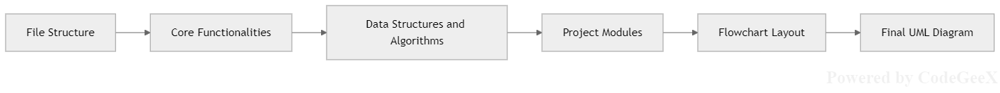
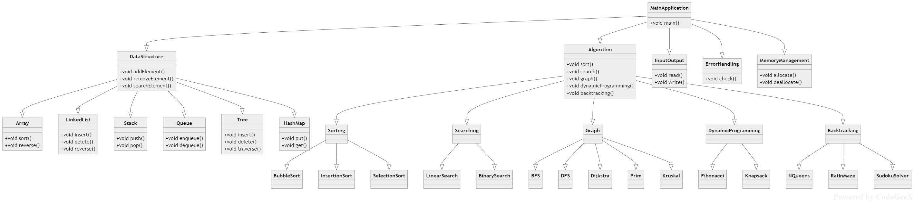

# Data Structures and Algorithms in C++

This project is a comprehensive repository for learning and practicing Data Structures and Algorithms (DSA) using C++.

The project is organized into multiple directories and subdirectories, each representing a specific aspect of DSA. Here's a brief introduction to each part of the project:

## Core Functionalities
This directory contains the core functionalities of the project, including data structures and algorithms. It includes various files and directories that cover different topics in DSA, such as arrays, linked lists, stacks, queues, trees, graphs, and more. Each file or directory within this section contains code snippets, algorithms, and explanations related to a specific topic.

## Project Modules
This directory contains the different modules of the project, each representing a specific aspect of DSA. The modules include:

- **Backtracking**: Covers backtracking algorithms (N-Queens problem, maze solving).
- **Graph**: Implements graph algorithms (cycle detection, topological sorting, shortest paths).
- **Hashmaps in C++**: Covers hashmap implementations.
- **Heaps in C++**: Covers heap implementations.
- **Linkedlist**: Includes singly/doubly/circular linked lists.
- **Queue**: Covers array/linked list/STL implementations.
- **Searching**: Includes linear/binary search algorithms.
- **Sorting**: Implements bubble/insertion/selection sorts.
- **Stack**: Covers array/linked list/STL implementations.
- **Tree**: Includes binary search trees and binary trees.
- **Trie**: Covers trie data structures.
- **Dynamic Programming**: Covers problems solved using optimal substructure and overlapping subproblems.
- **Greedy Algorithms**: Focuses on making locally optimal choices for global optimization.

## Additional Resources
- **Flowchart Layout**: [View Flowchart](https://github.com/tahseen07/DSA-in-CPP/blob/master/Flowchart%20Layout/Flowchart%20Layout.png)
- **Final UML Diagram**: [View UML Diagram](https://github.com/tahseen07/DSA-in-CPP/blob/master/Final%20UML%20Diagram/Final%20UML%20Diagram.png)

## Implemented Algorithms & Data Structures
- Sorting: BubbleSort, InsertionSort, SelectionSort
- Searching: LinearSearch, BinarySearch
- Graph Algorithms: BFS, DFS, Dijkstra, Prim, Kruskal
- Others: Fibonacci, Knapsack, NQueens, RatInMaze, SudokuSolver

---

## A Heartfelt Note ❤️

**Dear Love Babbar Sir and the CodeHelp team,**  
*22nd Feb 2025*

Today I completed the 149th and final video of your DSA series - a journey that began on 1st August 2024. For over half a year, your DSA playlist has been my constant companion.

This wasn't just about learning DSA; it became a beautiful daily habit I truly cherished. Your exceptional teaching style makes complex topics accessible, and your content quality is unmatched. Reaching this milestone brings both joy and a touch of sadness as this chapter closes.

**Thank you** for being more than a teacher - for being an inspiration. To fellow learners: **STICK WITH IT**! This playlist is a goldmine 🌟. Trust the process, and you'll look back with pride too!

Love Babbar Sir, you're a legend. This isn't "goodbye" but "see you later" - your lessons will forever be our compass 🧭.

With endless gratitude,  
Thank you from the bottom of my heart! ❤️🙏
